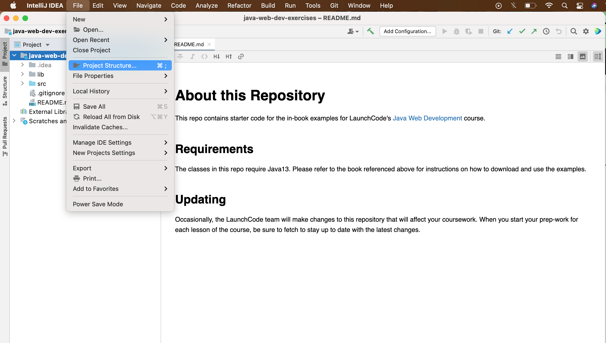
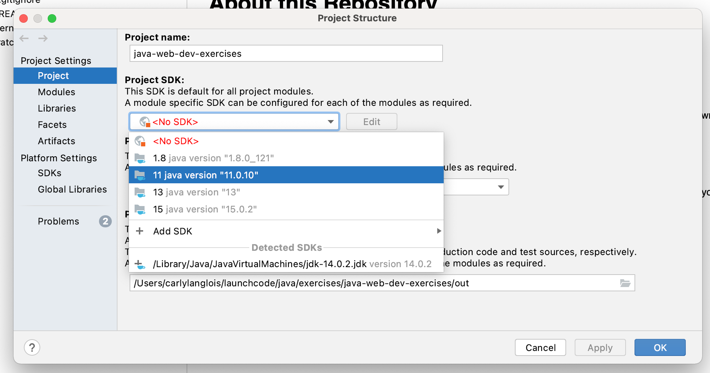
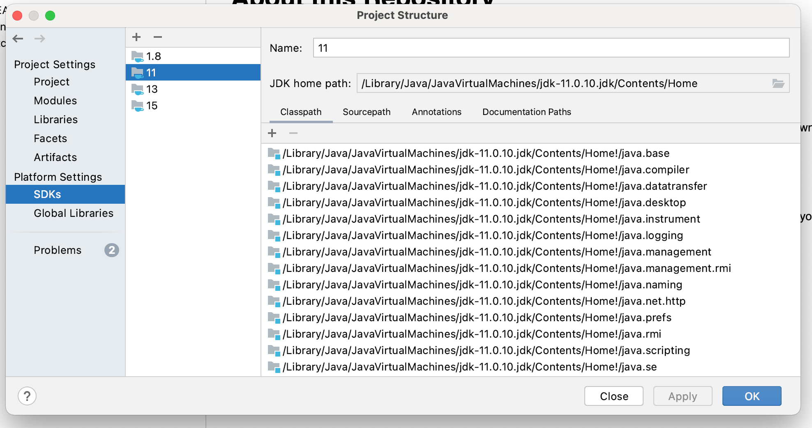

# About this Repository

This repo contains starter code for the in-book examples for LaunchCode's
[Java Web Development](https://education.launchcode.org/java-web-development/index.html)
course. 

## Requirements

The classes in this repo require Java11. Please refer to the book referenced
above for instructions on how to download and use the examples.

To update this Project's SDK to use Java11 on your computer: 

- Go to *File -> Project Structure*
  
- Under *Project Settings*, select *Project*
- Under *Project SDK*, select your downloaded Java 11 JDK.
    - Note: You may also download the JDK directly from your menu options here.
      
  
    
- Next, under *Platform Settings*, select *SDKs* and again select Java11.
  
- Once selected, hit *Apply* and *Ok*
    

## Updating

Occasionally, the LaunchCode team will make changes to this repository
that will affect your coursework. When you start your prep-work for each
lesson of the course, be sure to fetch to stay up to date with the 
latest changes. 